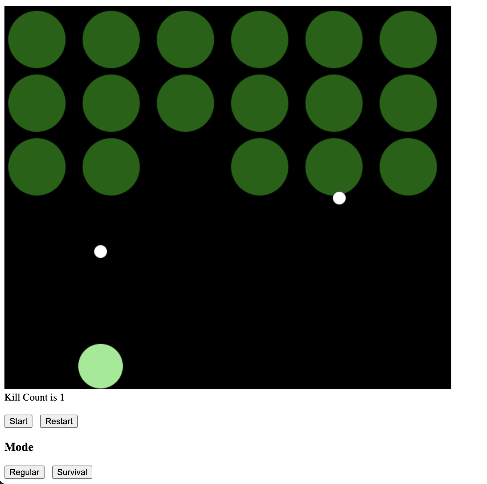
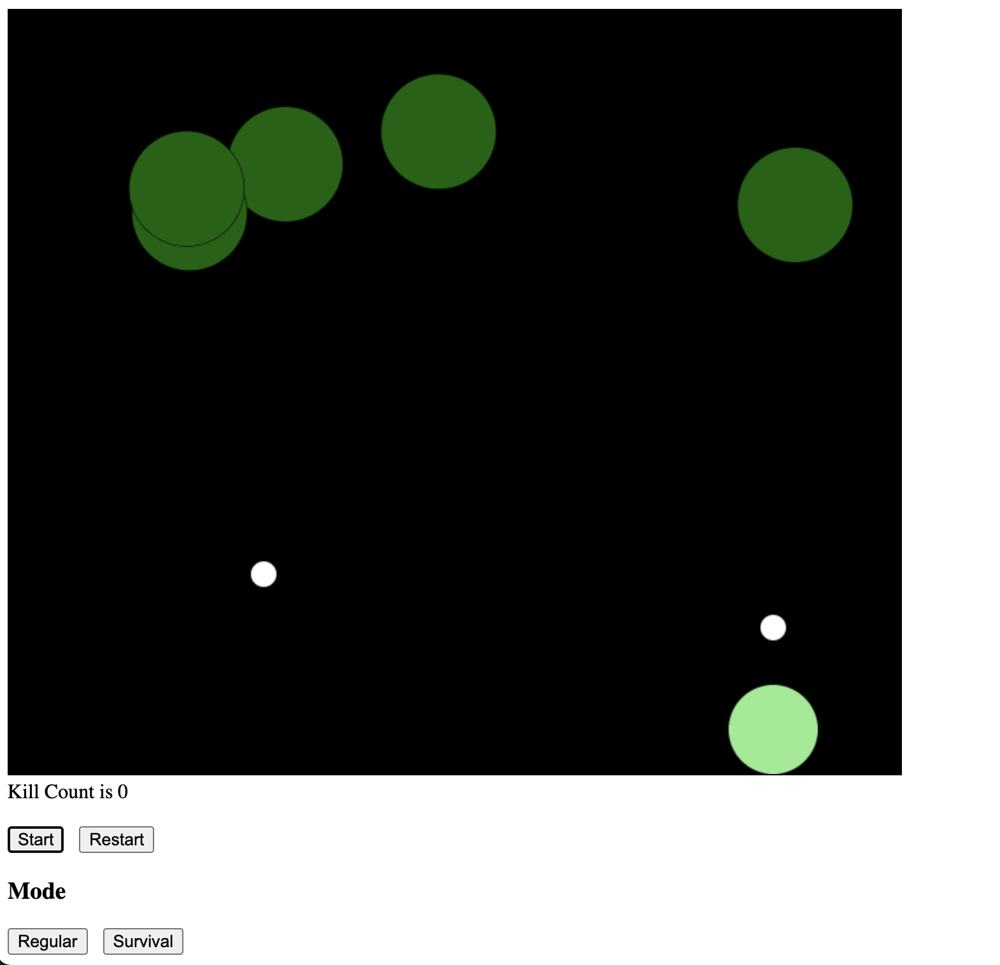

# Space Invaders - JavaScript

A remake of the classic game Space Invaders. This was done using vanillaJS.

## How to play

-- Warning: not modified for mobile users --

Go [here](https://vikramsodhan.github.io/) to play

To move use the left and right arrow keys.

To shoot press or hold space bar.

## Classic Mode

Hit the start button and you'll have to shoot down 30 aliens before they reach the bottom.

## Survival Mode

Be sure to click on the survival button before pressing start

Aliens will appear randomly and increase in speed the longer you survive

